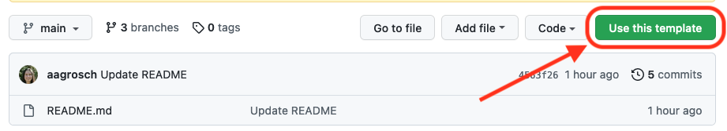
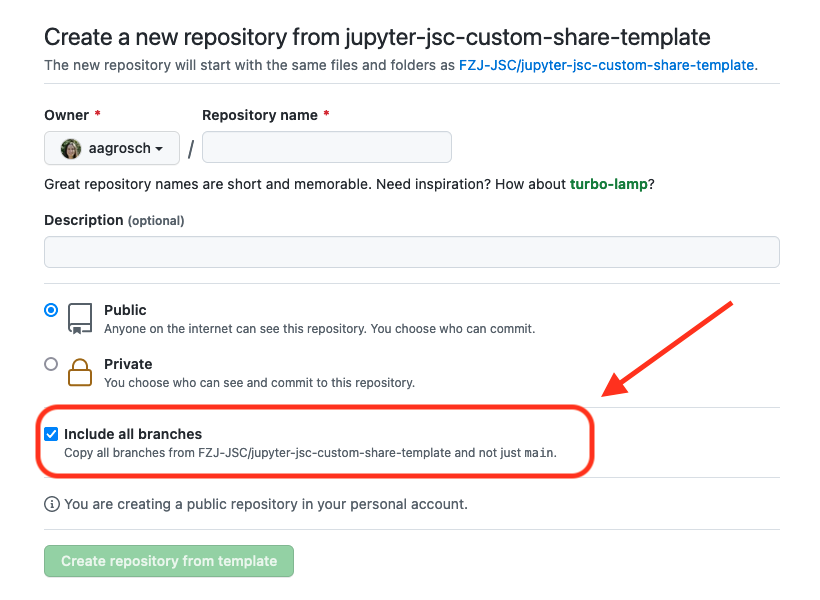

# jupyter-jsc-custom-share-template
Template repository for custom JupyterHub templates and static files.

To use this template, click **Use this template** above the file list 

and select **Include all branches** when creating your repository.


Reference templates and static files used by the Jupyter-JSC JupyterHub can be found [in this repository](https://github.com/FZJ-JSC/jupyter-jsc-share).

## How to create custom files

Any files which are placed in the `templates` and `static` directories will be used by Jupyter-JSC instead of the [default files](https://github.com/FZJ-JSC/jupyter-jsc-share/tree/main/jupyterhub). To help you to know which files you should modify, the `templates` directory contains files which are frequently  modified for custom JupyterHub instances. The `static` directory contains frequently modified static files such as css files, custom logos, etc.

If you don't want to modify a certain file but use the Jupyter-JSC default, simply delete it to take advantage of any updates such as bugfixes on Jupyter-JSC's side.

If you want to modify a file which is not present in this template repository, feel free to copy it from [the Jupyter-JSC repository](https://github.com/FZJ-JSC/jupyter-jsc-share) or create your own from scratch.

Use the `staging` branch to deploy the changes to your staging JupyterHub instance. After 60 seconds, you will see the changes on your staging instance. Once you are satisfied with your changes, merge the `staging` branch into the `production` branch.

## How to test custom files
### The convenient way - push to staging
You can and should test any changes. The convenient way is to push changes to the `staging` branches of your repository and wait 60 seconds for your changes to appear on your JupyterHub instance.

### The difficult way - locally
Alternatively, you can also test any changes with a local JupyterHub. To tell JupyterHub where it should look for templates and static data, you can specify template and data paths in your [JupyterHub config file](https://jupyterhub.readthedocs.io/en/stable/getting-started/config-basics.html). Some templates expect additional parameters which are also set in the configuration file. 

```python
# jupyterhub_config.py

c.JupyterHub.template_paths = ["<path/to/template/files>"]  # list
c.JupyterHub.data_files_path = "<path/to/static/files>"  # string

# Additional template variables expected by some templates
c.JupyterHub.template_vars = {
    "spawn_progress_update_url": "users/progress/update",
    "user_cancel_message": "Start cancelled by user.</summary>You clicked the cancel button.</details>",
}

```

Then, start a local JupyterHub using the config file: `jupyterhub -f /path/to/jupyterhub_config.py`
